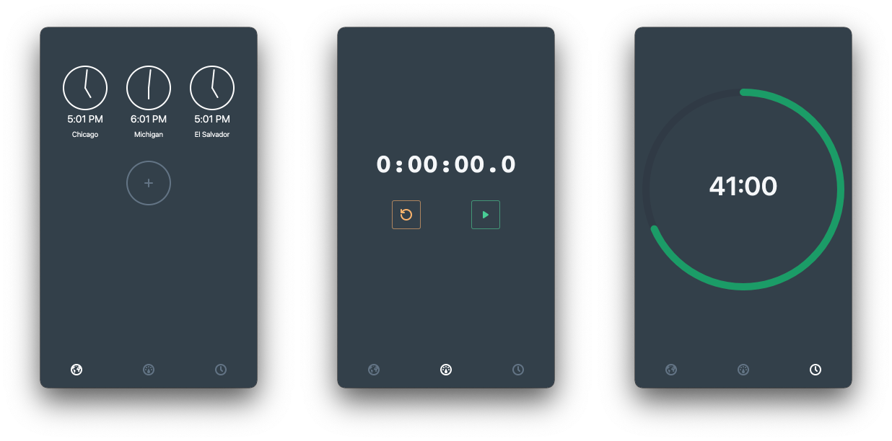

# Zhong
The missing clock for macOS and Windows

[](https://sonarcloud.io/dashboard?id=simonhochrein_Zhong)

## Screenshots



## Installation
You can download the latest release from the [releases](https://github.com/simonhochrein/Zhong/releases) page

## Development

After you clone the repo, and run these commands in separate terminals:

```
yarn dev
```

```
yarn start
```


## License
[MIT License](LICENSE)