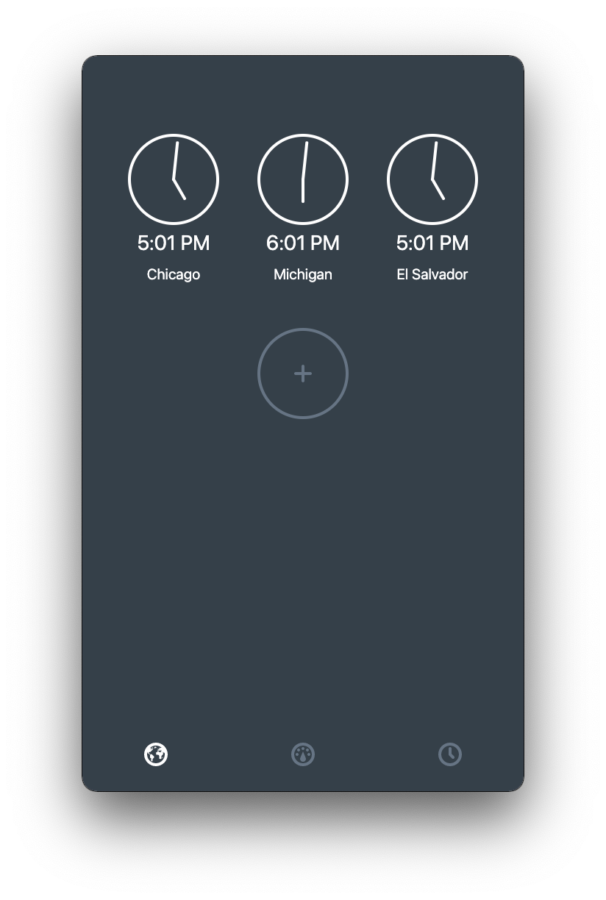
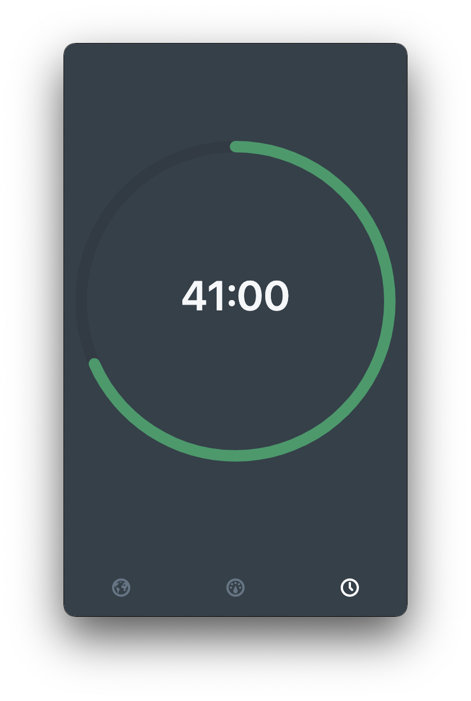

# Zhong
The missing clock for macOS and Windows

## Screenshots

## Installation
You can download the latest release from the [releases](https://github.com/simonhochrein/Zhong/releases) page

## License
[MIT License](LICENSE)